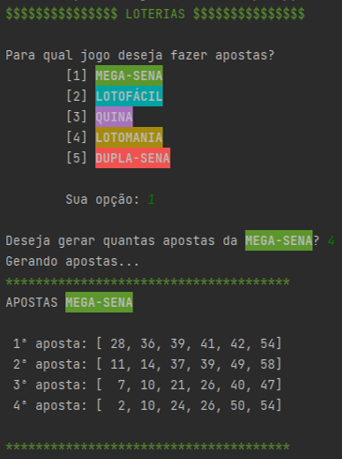
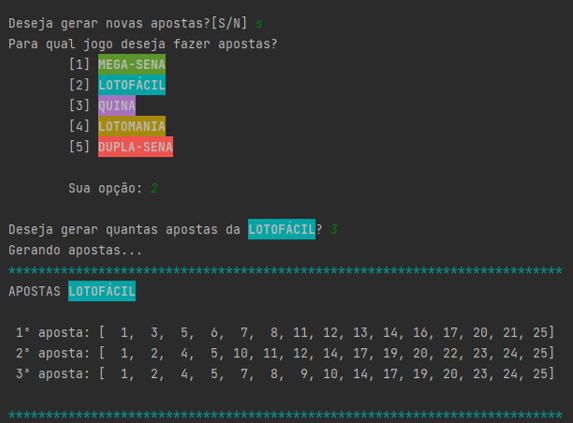

# 💰 Gerador de Apostas

Programa responsável por gerar apostar aleatórias para os principais jogos das Loterias.
Você quer gerar números para **MEGA-SENA**, **LOTOFÁCIL**,, **QUINA**, **LOTOMANIA** ou **DUPLA-SENA** e não sabe quais apostar?
Deixe o **GERADOR DE APOSTAS** te inspirar!

##  Como utilizar?
Selecione para qual jogo deseja fazer a aposta através do menu. Digite a quantidade de apostas a serem geradas para o jogo.

 

Também é possível gerar apostas para outro jogo ou para o mesmo, basta dar sequência no programa.

 

## 🛠 Tecnologias

 

## Autor

<strong> Luiz Almeida Jr</strong>

## 📝 License
This project is MIT licensed.